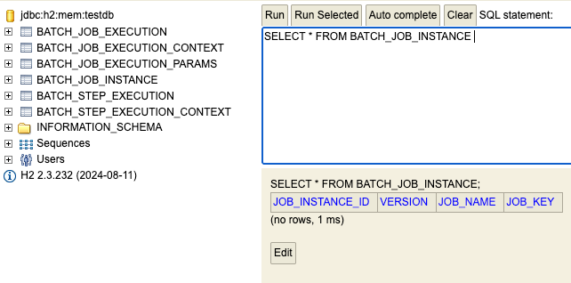

## JobInstance

### 개념

- Job 이 실행될 때 생성되는 Job 의 논리적 실행 단위 (고유하게 식별 가능한 작업)
- Job 설정과 구성은 동일하지만 Job 이 실행되는 시점에 처리하는 내용은 달라서 Job 구분 필요해보임
  - 만약 하루에 한 번 씩 배치 Job 이 실행된다면 매일 실행되는 각각의 Job 을 JobInstance 로 표현

- `JobInstance` 생성 및 실행
  - 처음 시작하는 `Job` + `JobParameter` 일 경우 새로운 `JobInstance` 생성
  - 이전과 동일한 `Job` + `JobParameter` 으로 실행 할 경우 이미 존재하는 `JobInstance` 리턴
    - (내부적으로 `JobName` + `jobKey(해시값?)`를 가지고 객체를 얻음)
  - `Job` 과는 1:M 관계

---

### BATCH_JOB_INSTANCE 테이블과 매핑

- `JOB_NAME` 과 `JOB_KEY (JobParameter 해시값)` 가 동일한 데이터는 중복해서 저장안됨

---

## 지금까지 이해한 대략적인 스프링 배치 도메인 흐름

1. `JobLauncher` 를 실행하기 위해서 `Job` 객체와 `JobParameter` 두개의 값이 필요함
`run(job, parameter)` 예를 들어 `Job = 일별 정산`, `JobParameter = 날짜`

2. `JobRepository` 에서 실제 `Job` 실행 중에 생성되는 메타데이터를 데이터베이스에 저장 및 업데이트하는 클래스?
3. `JobRepository` 가 `DB` 에서 `Job & JobParamters` 를 이용해서 처음 실행하는 건지? 예전에 있던 건지 확인
4. 만약 한번이라도 수행해서 존재하는 값이면 기존의 `JobInstance` 를 리턴함
5. 존재하지 않는 값이면 새로운 `JobInstance` 생성 후 리턴

예를 들어 `웹툰 일별 정산` 이라는 `Job` 이 있다고 가정하자.
`JobInstance A` 가 만들어지고 여기서 `Job = 일별 정산` 이 될 것이고, 
`JobParameters = 2025년 10월 28일` 오늘날 날짜가 될 것이다.

만약 이 `웹툰 일별 정산` 이라는 `Job` 이  2025년 10월 29일날 작동된다고 가정한다면
`JobInstance B` 가 만들어질 것이고 `JobParameters = 2025년 10월 29일` 이 될 것이다.
그 말은 즉, `BATCH_JOB_INSTANCE` 테이블의 row 는 2개가 쌓일 것이다.

| JobInstance ID | Job Name      | Job Key                       |  
|----------------|---------------|-------------------------------|
| 1              | `웹툰 일별 정산`| `123124efldnflsnfsadlfere`    |
| 2              | `웹툰 일별 정산` | `sflnrl343dfsgnfdlsnl3434`    |

