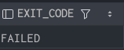
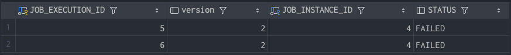
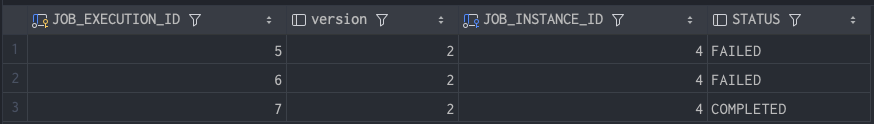

## JobExecution

- Job 실행 중에 발생한 정보들을 저장하고 있는 객체
  -시작 시간, 종료 시간, 상태(시작됨, 완료, 실패), 종료 상태의 속성을 가짐

### JobInstance 와의 관계
- `JobExecution` 은 `FAILED` 또는 `COMPLETED` 등의 Job 의 실행 결과 상태를 가지고 있음
- `JobExecution` 의 실행 상태 결과가 `COMPLETED` 면 JobInstance 실행이 완료
- `JobExecution` 의 실행 상태 결과가 `FAILED` 면 JobInstance 실행이 완료되지 않은 것으로 간주해서 재실행
  - `JobParameter` 가 동일한 값으로 Job 을 실행해도 JobInstance 를 계속 실행할 수 있음
- `JobExecution` 의 실행 상태 결과가 `COMPLETED` 될 때까지 하나의 JobInstance 내에서 여러 번의 시도가 생길 수 있음

---
### JobExecution 
```java
JobParameters    // JobParameters 객체 저장
JobInstance      // JobInstance 객체 저장
ExecutionContext // 실행하는 동안 유지해야 하는 데이터
BatchStatus      // 실행 상태를 나타내는 Enum 클래스 (COMPLETED, STARTING, STARTED, STOPPING, STOPPED, FAILED, ABANDONED, UNKNOWN)
failureExeptions // Job 실행 중 발생한 예외 리스트
startTime        // Job 을 실행할 때의 시스템 시간
createTime       // JobExecution 이 처음 저장될 때의 시스템 시간
endTime          // 성공 여부와 상관없이 실행이 종료되는 시간
lastUpdated      // JobExecution 이 마지막 저장될 때의 시스템 시간

```
---
## 배치 실패 

`_4_JobExecution` 의도적 실패를 한다면
`BATCH_JOB_EXECUTION` 테이블의 `EXIT_CODE`값이 변화된걸 볼 수 있다.



한번 더 `_4_JobExecution` 의도적으로 실패 한다면
`BATCH_JOB_INSTANCE` 의 값은 변하지 않는다.
결과 값을 보면 `BATCH_JOB_INSTANCE` 의 값은 추가되지 않지만,
`BATCH_JOB_EXECUTION` 테이블에는 `STATUS=FAILED` 값으로 계속 객체가 생성되는것을 볼 수 있다.




---
## 배치 성공

`_4_JobExecution_Run_Fail_Config.java` 에서 예외를 제거하고 다시 실행해 보자.

여전히 `BATCH_JOB_INSTANCE` 의 테이블의 값은 변함없다.


그리고 `BATCH_JOB_EXECUTION` 의 테이블에는 `COMPLETED` 라는 상태값으로 객체가 추가되었다.


---
## 정리


```java
JobInstance ID: 1
 ├─ JobExecution ID: 1 → FAILED
 ├─ JobExecution ID: 2 → FAILED
 └─ JobExecution ID: 3 → COMPLETED (종료)
```

- `JobInstance`
  - (`JobName` + `JobParameters`) 조합으로 유일하게 생성
  - 동일 파라미터로는 **한 번만 생성**, **재실행 시** 기존 `JobInstance` 유지
- `JobExecution`
  - `JobInstance` 실행 시마다 새로 생성되는 실행 기록.
  - `FAILED` 시 새로운 `JobExecution` 생성
  - `COMPLETED` 시 동일 파라미터로 **재실행 불가**

