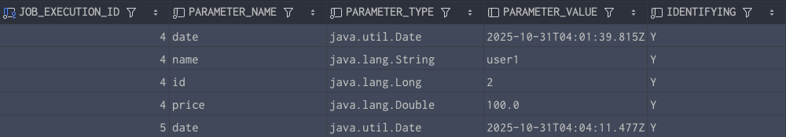

## ExecutionContext

- 프레임워크에서 유지 및 관리하는 키/값으로 된 컬렉션으로 `StepExecution` 또는 `JobExecution` 객체의
상태를 저장하는 공유 객체
- DB에 직렬화 한 값으로 저장됨 ( {`"key"` : `"value"`)
- 공유 범위
  - `Step` 범위 - 각 Step 의 `StepExecution` 에 저장되며 Step 간 서로 공유 안됨
  - `Job` 범위 - 각 Job 의 `JobExecution` 에 저장되며 Job 간 서로 공유 안되며 해당 Job 의 `Step`간 서로 공유됨
- Job 재시작시 이미 처리한 `Row` 데이터는 건너뛰고 이후로 수행하도록 할 때 상태 정보를 활용

```java
import java.util.concurrent.ConcurrentHashMap;

Map<String, Object> map = new ConcurrentHashMap<>();
```
---
### 데이터베이스 확인
`_8_RunJob_Main` 을 실행하게 되면 `_8_1_tasklet` ~ `_8_4_tasklet` 이 실행되는데

위 스크린샷을 보면 `_8_1_tasklet` 에서는 `jobName`과 `taskName` 모두 출력된다.
하지만 `_8_2_tasklet` 에서는 `stepName` 은 출력되지않는다. 이유는
`Step` 간에는 서로 참조 할 수 없기 떄문이다. <br>

그리고 `_8_3_tasklet` 에서 일부러 오류를 내보면 실패가 뜬다. 디비를 확인해보면 `_8_3_tasklet` `FAILED` 가 뜬걸 확인 할 수 있다.


마지막으로 한번 더 실행을 한다면 `COMPLETED` 가 된것을 확인 할 수 있다.


**여기서 알 수 있는것은 이미 실행된 `tasklet` 은 그냥 지나가고 재실행되며 이전에 넣어둔 데이터도 보관된다.**
